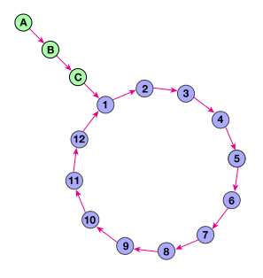

# Can you get the loop?

You are given a node that is the beginning of a linked list. This list contains a dangling piece and a loop. Your objective is to determine the length of the loop.

For example, in the following picture the size of the dangling piece is 3 and the loop size is 12:


```c
// Use the `next` field to get the following node.
Node* nextNode = nodePtr->next;
```

### Notes:

* Do **NOT** mutate the nodes!
* In some cases there may be only a loop, with no dangling piece

> Thanks to shadchnev, I broke all of the methods from the Hash class.

> Don't miss dmitry's article in the discussion after you pass the Kata !!